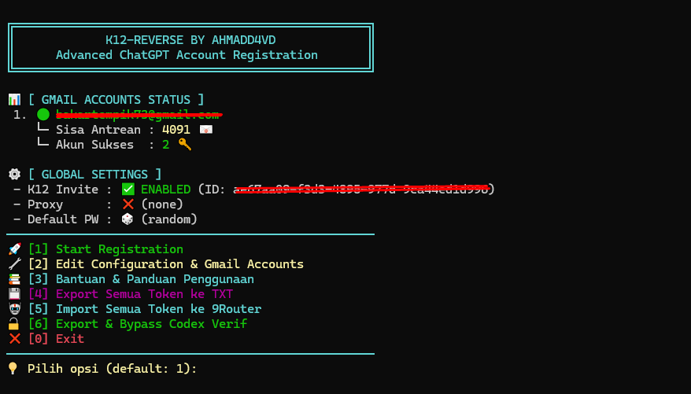

<div align="center">

# K12-Reverse 

[](https://github.com/ahmdd4vd/K-12-reverse/stargazers)
[](https://golang.org/)
[](https://opensource.org/licenses/MIT)

**Advanced High-Concurrency ChatGPT Account Registration System**

</div>

---

K12-Reverse adalah *command-line interface* (CLI) berskala produksi yang dirancang khusus untuk mengotomatisasi pendaftaran akun ChatGPT secara massal. Dibangun dengan Golang, sistem ini memanfaatkan teknik *Dot-Trick* Gmail dan integrasi IMAP *headless* untuk mengekstrak OTP secara otonom tanpa intervensi manual.

Sistem ini didesain dengan arsitektur konkurensi tingkat tinggi (lock-free) yang memungkinkan pemrosesan puluhan akun secara paralel pada *thread* yang berbeda, memastikan kecepatan dan efisiensi maksimal.

## 💡 Mengapa Menggunakan K12-Reverse? (Nilai & Manfaat)

Sebagian besar *developer* dan *engineer* menghadapi batasan ketat (*rate limits*) saat menggunakan layanan AI seperti Codex atau ChatGPT untuk penulisan kode skala besar. K12-Reverse hadir untuk memecahkan masalah tersebut dengan memberikan suplai akun tak terbatas secara otomatis.

Keuntungan utama menggunakan sistem ini:
1. **Otomatisasi Massal (Zero-Touch)**: Memproduksi ratusan hingga ribuan akun ChatGPT terverifikasi hanya dengan sekali jalan (memanfaatkan satu Gmail utama).
2. **K12 Workspace Injection (Setara Plus/Pro)**: Mengikat akun yang baru dibuat ke dalam *Workspace* Edukasi (K12). Akun K12 memiliki kuota pemrosesan, *limit* permintaan, dan prioritas *server* yang setara dengan **ChatGPT Plus / Business / Pro** bergantung pada spesifikasi *Workspace* Anda.
3. **Rotasi Akun Tanpa Batas Limit**: Dengan suplai akun K12 yang masif dan integrasi langsung ke ekosistem Codex maupun 9Router, Anda dapat melakukan rotasi kredensial. **Hasilnya: Anda bisa menggunakan Codex secara intensif seharian penuh tanpa pernah khawatir kehabisan kuota atau terblokir *limit*.**

## 📸 Preview


---

## ⚙️ Fitur Utama

- **Codex Verification Bypass (Auto-Injector)** (Baru di v1.3)
  Mengekstrak dan mengubah token K12 menjadi *Synthetic JWT Token*, lalu menyuntikkannya langsung ke dalam konfigurasi lokal Codex (`~/.codex/auth.json` atau `%USERPROFILE%\.codex\auth.json`). Mengakali verifikasi nomor telepon secara instan.
- **9Router Seamless Integration** (Baru di v1.3)
  Mengimpor token secara otomatis ke dalam *database* 9Router pengguna (mendukung konfigurasi NVM, NPM Global, Mac, Windows, dan Linux).
- **Multi-Workspace K12 Injection** (Baru di v1.3)
  Mendaftarkan satu akun (dan sub-variasinya) ke beberapa *Workspace* K12 secara bersamaan tanpa benturan kredensial.
- **Multi-Gmail Dot-Trick**
  Menghasilkan ribuan variasi email unik dari satu *base email* tanpa memicu sistem anti-spam Google.
- **Lock-Free IMAP Auto-Read**
  Membaca *inbox* via IMAP dengan validasi *Exact Match* pada filter *Header*. Memungkinkan konkurensi skala masif tanpa perebutan token OTP antar *worker*.
- **Smart Proxy & Auto-Resume**
  Mendukung rotasi proksi SOCKS5/HTTP dan mampu melanjutkan pendaftaran yang terputus dengan tepat.

---

## 🚀 Panduan Instalasi

K12-Reverse dirancang untuk dapat dijalankan secara instan (*plug-and-play*).

### Persyaratan Sistem
- **Go** (minimal versi 1.25.5)
- **Akun Gmail Utama** (dilengkapi dengan *App Password* / Sandi Aplikasi 16-digit)
- *(Opsional)* **Proxy** (Residential/Static proxy direkomendasikan untuk mencegah limitasi Cloudflare)

### Menjalankan Program

```bash
# 1. Kloning repositori
git clone https://github.com/ahmdd4vd/K-12-reverse.git
cd K-12-reverse

# 2. Jalankan sistem (Wizard interaktif akan otomatis muncul pada eksekusi pertama)
go run cmd/register/main.go
```

### Konfigurasi Lanjutan
Pada menu utama CLI, pilih **Opsi [2]** untuk mengelola *Base Email*, *App Passwords*, daftar URL Proxy, dan pendaftaran otomatis *Workspace* K12. Seluruh konfigurasi Anda akan disimpan secara aman di dalam `config.json`.

---

## 👥 Kontributor

Pengembangan alat ini tidak lepas dari dukungan komunitas *open-source*. Kami mengucapkan terima kasih kepada:

- **@ahmdd4vd** – Penulis Utama & Arsitek Sistem
- **@ricatix** – *Proxy Preflight Check* & *Graceful Shutdown* Mechanism
- **@gede-cahya** – Fondasi Integrasi Auto-Import 9Router

Kami sangat terbuka untuk *Pull Request*. Jika Anda memiliki optimasi struktur, perbaikan kutu (*bug*), atau penambahan modul ekstraksi pihak ketiga, silakan berkontribusi.

---

## ☕ Dukung Proyek Ini (Donate)

Jika *tool* K12-Reverse ini telah membantu menghemat waktu Anda, membantu pekerjaan Anda dengan Codex, atau Anda sekadar ingin memberikan dukungan untuk kelanjutan pengembangannya, Anda bisa mentraktir saya secangkir kopi:

[](https://trakteer.id/ahmad_david11/tip)

Dukungan Anda sangat berarti untuk membiayai infrastruktur eksperimen dan waktu pengembangan di rilis-rilis selanjutnya!

---

## 📜 Lisensi

Proyek ini didistribusikan di bawah **MIT License**. Anda bebas menggunakan, memodifikasi, dan mendistribusikan perangkat lunak ini. Lihat file `LICENSE` untuk detail lebih lanjut.
